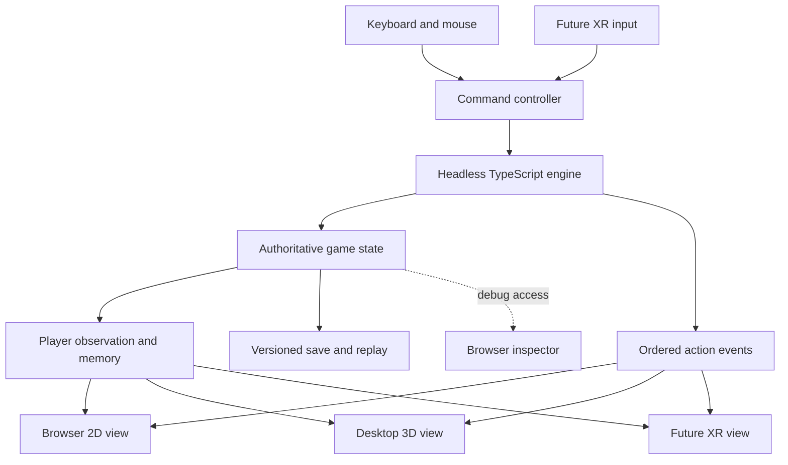

# rougeXR design: browser first

For concrete types, module contracts, algorithms, and code-generation work packages, use the [TypeScript implementation specification](typescript-implementation.md). It refines the interface sketches in this architectural document.

## Objective and scope

Build and debug the game in a regular desktop browser using a keyboard and mouse. A headset, XR session, motion controller, or WebXR support must never be required to start a game, inspect state, reproduce a bug, or test the rules.

The first playable version uses a two-dimensional dungeon view. The next version adds a desktop three-dimensional view of the same game. XR becomes another input and presentation adapter after these work.

Use [Davidslv/rogue](https://github.com/Davidslv/rogue), Rogue 5.4.4, as the selected source and behavioral base. Pin the initial reference to commit `f4653c2a2ee6981a73abe9dfda055134285e1e79`. Record intentional differences in the [rules ledger](rules-ledger.md); upstream updates require an explicit review rather than silently changing the rules. See [the selected source notes](rogue544-base.md). The FreeBSD Clone III review is historical comparison material, not this project's specification.

This document specifies the implementation; it does not claim that the browser application already exists.

## Architecture



The engine imports no DOM, canvas, Three.js, WebXR, storage, or wall-clock APIs. It runs synchronously from explicit actions and an explicit random source. The browser shell owns input, rendering, downloads, and persistence.

Game state is authoritative after every resolved action. Rendering never writes gameplay state back when a room is unloaded. Views can be destroyed and rebuilt from the latest observation without changing the game.

Start with TypeScript and a browser development server, using a simple HTML interface and Canvas 2D for the map. Add Three.js only for the desktop 3D milestone. Choose and pin package versions when implementation starts.

## Browser debugging interface

The page opens directly into a usable desktop interface. Its initial layout is:

```text
 Seed [12345] [New game] [Save] [Load] [Export bug report]
 View [2D | 3D later]  Knowledge [Player | Reveal debug]
 +----------------------------------+--------------------------+
 |                                  | Player / inventory       |
 |         Dungeon viewport         | Selected cell / entity   |
 |                                  | Last action and outcome  |
 |                                  | Events and timing        |
 +----------------------------------+--------------------------+
 | Message log                      | Replay controls          |
 +----------------------------------+--------------------------+
```

The default map shows only what the player can currently perceive or remember. It distinguishes visible terrain from remembered terrain, and shows objects and monsters according to observation rules. Unknown cells remain blank. Clicking a cell selects it for inspection without moving the player or spending time.

An explicit Reveal debug toggle shows authoritative terrain, hidden features, monster positions, and region IDs. It has a persistent visible badge. Reveal is a developer overlay; it does not change discovery, target eligibility, or the observation sent to normal views.

The inspector shows player stats, equipment, status durations, simulation tick, action sequence number, selected entity location, and the last action's time cost. An expandable advanced section exposes RNG state, entity IDs, and scheduler/counter state. These details stay in debugging panels rather than the normal game interface.

The event log groups entries by submitted action and distinguishes rejected actions, free actions, and actions that advance simulation. Filter by movement, combat, inventory, effects, or generation. Selecting an event highlights its affected cells when that information is available in the chosen inspection mode.

## Desktop controls

| Input | Behavior |
| --- | --- |
| Arrow keys or H/J/K/L | Move one cardinal tile; bump attack if permitted |
| Y/U/B/N or numeric keypad diagonals | Move one diagonal tile |
| Period or numpad 5 | Rest |
| S | Search |
| Comma | Pick up at the player's position |
| I | Open or close inventory; no simulation advance |
| Inventory buttons | Explicit use, equip, remove, or drop actions |
| Greater-than / less-than | Descend or ascend when allowed |
| Escape | Cancel pending selection or close a panel |
| Mouse click on map | Inspect a cell; no simulation advance |

Key mappings belong to the input adapter. Ignore gameplay shortcuts while a text field is focused. Suppress native browser behavior only for handled keys while the game viewport has focus. Ignore operating-system key repeat initially: one intentional press submits one action. Automated running and repeated actions can be introduced later with explicit cancellation and stop conditions.

Commands requiring a target or inventory selection remain pending until completed or canceled. Opening a menu and choosing a target are not themselves engine turns. The final committed action is validated against current state.

## Engine action and timing contract

```typescript
interface ActionResolution {
  actionSequence: number;
  status: 'resolved' | 'rejected';
  reason?: string;
  ticksAdvanced: number;
  events: GameEvent[];
}

interface GameEngine {
  execute(action: GameAction): ActionResolution;
  observe(): PlayerObservation;
  exportSave(): GameSave;
}
```

Do not equate a failed movement with a free action. The timing policy follows the reference behavior, including attacks that leave the player in place and restrictions that may consume time. `ticksAdvanced` reports the result; action handlers explicitly invoke the rules for world advancement rather than the browser inferring it.

Preserve `command()` cycle semantics: BEFORE daemons and fuses run before player action slots; haste initially grants two slots rather than one; commands setting `after = FALSE` do not consume a slot; AFTER daemons and fuses and ring effects run after the slots are exhausted. A simulation tick represents one completed command cycle. Do not import Clone III's alternating search cost or `reg_move()` ordering.

The browser cannot block while waiting for the next command as the C program does. Represent the pending cycle explicitly, including its phase and remaining action slots. Run BEFORE processing once when entering a cycle, expose the resulting state at the input boundary, and resume that cycle on the next committed action. Free commands do not restart BEFORE processing. Save and replay preserve this pending state, including a save between hasted actions. Input preparation is a deterministic engine operation; render callbacks never advance a cycle. Expose its events alongside action events so changes before input are inspectable.

Every submitted engine action increments the diagnostic action sequence, including rejections. UI-only inspection never submits an engine action. Action events can overlap: one movement may enter a region, pick up an object, trigger a feature, and cause monster responses.

Resolve state atomically before rendering its animations. Initially allow one committed action at a time; animation may be skipped or sped up without changing results. Do not queue unbounded key or gesture input while an animation plays. On reload or view switching, rebuild from observation rather than requiring the event history.

## Domain model and ownership

Game state contains the player, current dungeon level, entity registry, identification mappings, player knowledge, behavioral counters, random state, rules version, and game status. The current level remains fully simulated in memory regardless of which room is rendered.

Tiles represent terrain separately from features and occupancy. A monster and a floor object may occupy the same cell. Region and corridor metadata support generation, debugging, and rendering, but tiles determine legal movement.

Entities have stable IDs and exactly one authoritative location: a floor position, player inventory, or monster inventory. Equipment references player-owned items. Room and tile indexes are derived and rebuilt or checked when loading a save. Preserve monster packs from `t_pack`, including carried loot and its release on death; the Clone III restriction against monster inventories does not apply.

On a level transition, remove the previous floor's entities and generate the next map while preserving the player and carried items. Persistent revisitable floors are outside the initial ruleset.

Use structured dice groups and port `fight.c` and weapon behavior from the selected commit. Do not carry over the Clone III armor-reduction or enchantment formulas. Separate immutable definitions from per-game randomized identification mappings and mutable entity state.

## Observation and events

Maintain current perception and remembered information explicitly. Removing curses must preserve the information it previously retained. Knowledge includes discovered terrain and features, item appearance mappings, and whatever remembered object information the chosen rules permit.

Views receive a player-safe observation, not the entire state. Raw engine events may contain hidden monster activity; pass them through an observation-aware presentation step before ordinary messages, highlights, audio, or animations consume them. The debug inspector has a separate read-only route to raw state and raw events.

Switching camera position, zooming out, enabling a debug overlay, or entering XR never changes visibility rules or advances simulation. Tabletop mode is inspection-only initially.

## Save, replay, and bug reproduction

Use an explicit JSON save schema with save-format version, rules version, RNG algorithm/version and state, all authoritative entities, knowledge, identification data, counters, pending command cycle, scheduled daemons/fuses, and the next entity ID. Scheduled entries encode effect types, phase, arguments, remaining duration, and stable execution order rather than C function pointers. Validate imports before replacing the running game. Reject unsupported versions with a readable message.

Browser storage provides a convenience autosave after completed actions. Manual JSON download/upload remains available if browser storage is unavailable. Save loading reconstructs derived indexes and validates ownership and positions.

A bug report is a downloadable JSON bundle containing the initial checkpoint, subsequent submitted engine actions, rules/build identifiers, and expected state checksums. Record rejected actions too: a rejected action can still consume randomness in some rule paths. Keep event history bounded in memory; when rotating the log, advance its initial checkpoint so the exported history stays replayable.

Replay controls provide restart, next action, play, pause, and speed. A replay step executes one recorded action, which may advance zero or multiple ticks. Normal gameplay input is disabled during replay. Show the first checksum divergence with the action and relevant state difference. Backward navigation reloads a checkpoint and replays forward; it is not a gameplay undo mechanic.

Developer fixtures provide small reproducible situations: corridor movement, diagonal doors, a monster encounter, a hidden trap, inventory stacking, status expiry, and a level transition. Fixture setup is recorded in the initial checkpoint. Keep fixture loading separate from normal gameplay commands.

## Desktop 3D before XR

Use [Quick 3D MMORPG as a presentation reference](quick-3d-mmorpg-review.md) for camera smoothing, animation transitions, and animated asset loading. Adapt these patterns behind the existing observation/action boundary. The Rogue engine and browser-first sequence remain the implementation base.

After the 2D engine works, attach a desktop 3D renderer to the same observation and action interfaces. Preserve the 2D map and inspector alongside it so a rendering error can be compared against the logical result.

Mouse drag controls look direction; a separate orbit control supports tabletop inspection. Grid movement remains the same discrete commands. Camera movement alone does not move the game actor. This separates debugging of camera transforms, tile scale, room geometry, visibility, and entity placement from debugging the rules.

Render the current room and relevant visible passage geometry in detail, with lightweight discovered map geometry elsewhere. Use simple primitives before introducing imported models. Room activation releases visual resources only. Verify transitions at doors, mazes, and region boundaries rather than assuming all scenes are rectangular rooms.

If WebXR is unavailable, all desktop functionality remains usable and the optional XR entry control explains that XR is unavailable. Capability detection must not prevent application startup.

## XR integration boundary

XR input later translates controller or hand intentions into the same committed actions. Physical head movement affects the camera within a defined comfort envelope; crossing a tracked-space tile boundary does not automatically bypass engine movement validation. Virtual locomotion commits legal tile movement, then presentation follows the resolved position.

Prototype action commitment, rejected movement, swing debouncing, and animation cancellation in desktop mode first. XR-specific comfort and tracking behavior still require headset testing, but engine correctness, scene construction, persistence, and most interaction state transitions must already be testable without one.

## Proposed project layout

```text
src/
  engine/         state, rules, generation, actions, RNG, observations
  definitions/    item and monster definitions
  persistence/    save validation, migrations, replay bundles
  input/          desktop commands; later XR commands
  presentation/
    grid/         Canvas 2D player view
    three/        desktop 3D; later XR scene presentation
  debug/          inspector, reveal overlay, fixtures, replay controls
  app/            browser shell, storage, view switching
tests/
  engine/         deterministic rule and continuation cases
  browser/        keyboard, panels, import/export, desktop startup
documents/
  design.md
  rules-ledger.md  source mappings and intentional differences
  rogue544-base.md selected upstream revision and source notes
```

## Milestones and acceptance gates

1. **Browser foundation:** open a local URL, enter a seed, generate and inspect a 2D dungeon. No XR API is required. Same seed and rules version produce the same initial state. Map bounds and reachable generated regions pass invariant checks.
2. **Playable rules slice:** keyboard movement, bump combat, search, rest, one item interaction, and level transition work. The inspector explains action timing. Characterization cases cover diagonal legality, blocked moves, bear traps, search, free commands, BEFORE/AFTER ordering, and hasted action slots before those mechanics are called faithful.
3. **Reproduction and persistence:** save/load continuation matches uninterrupted play. A downloaded bug bundle reproduces the final checksum in a fresh browser session. Invalid imports leave the running game intact. Inspection and rendering do not change gameplay RNG or state.
4. **Desktop 3D:** the same saved game and action sequence produce identical engine state in 2D and 3D. Camera changes and room teardown do not mutate state. Normal views and messages do not expose hidden information.
5. **XR adapter:** headset entry, tracking, and gesture input reuse the verified engine. Browser debugging remains available throughout XR development.

Initial manual checks run in desktop Chromium and Firefox. Browser automation should exercise real keyboard input, focus handling, inventory cancellation, save import/export, and startup without WebXR. Engine checks run without a browser. No headset is part of the acceptance gate for milestones 1 through 4.
